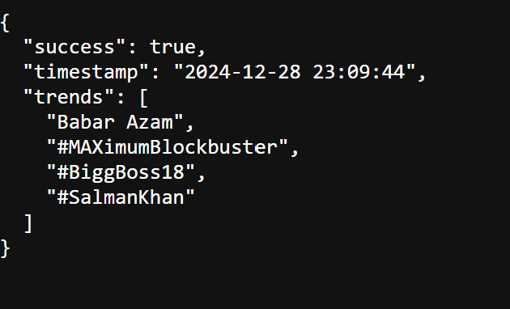

# Twitter Scraper with Proxy Integration

This is a simple web scraping application that scrapes trending topics from Twitter using Selenium and proxies. The application is built with Flask and stores the scraped data in MongoDB.

## Features

- **Login to Twitter**: Automates logging into Twitter using Selenium.
- **Scrape Trending Topics**: Scrapes the current trending topics on Twitter.
- **Proxy Integration**: Supports proxy rotation using ProxyMesh to avoid IP blocking.
- **MongoDB Integration**: Stores scraped data (trending topics and IP address) in MongoDB.
- **Environment Configuration**: Loads sensitive configuration like credentials and proxy URL from `.env` file.

## Technologies Used

- **Backend**: Flask
- **Web Scraping**: Selenium
- **Database**: MongoDB
- **Proxy**: ProxyMesh
- **Environment Variables**: `dotenv` (to manage sensitive information)
- **Python Libraries**:
  - `Flask`
  - `selenium`
  - `pymongo`
  - `python-dotenv`

## Setup and Installation

### Prerequisites

Make sure you have the following installed:
- Python 3.7+
- ChromeDriver (compatible with your version of Google Chrome)
- MongoDB running locally or on a cloud service

### Installation Steps

1. Clone the repository:
    ```bash
    git clone https://github.com/yourusername/twitter-scraper.git
    cd twitter-scraper
    ```

2. Create a virtual environment and activate it:
    ```bash
    python -m venv venv
    # On Windows
    venv\Scripts\activate
    # On macOS/Linux
    source venv/bin/activate
    ```

3. Install the required dependencies:
    ```bash
    pip install -r requirements.txt
    ```

4. Set up your environment variables in a `.env` file. Create the `.env` file at the root of the project with the following content:

    ```env
    TWITTER_EMAIL=your_email@example.com
    TWITTER_PASSWORD=your_password
    TWITTER_USERNAME=your_username
    PROXYMESH_URL=http://your_proxy_url:port
    ```

5. Make sure you have ChromeDriver installed:
    - Download ChromeDriver from [here](https://sites.google.com/a/chromium.org/chromedriver/).
    - Place it in the project directory or ensure it's in your system's PATH.

6. Run the Flask application:
    ```bash
    python app.py
    ```

7. The application should now be running at `http://127.0.0.1:5000`.

### Running the Scraper

- To run the scraper and fetch trending topics, visit the `/scrape` route:
  ```plaintext
  http://127.0.0.1:5000/scrape

And Final output look like 
